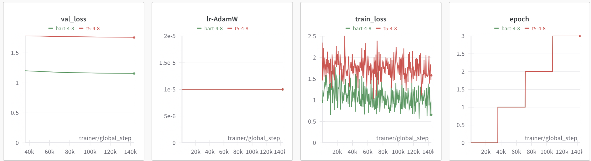

# Abstractive Text Summarization

## Result

## Clone

```bash
!git clone https://github.com/cristiano2003/Text-Summarization.git
%cd Text-Summarization
```

## Setup, Build Package and download Checkpoint and Dataset 

```bash
!source scripts/setup.sh
```

## Train

```bash

!python -m summarization.train --model "T5" -me 3 --batch_size 8  -w -wk {wandb_key}

```

## Train all

```bash

!python -m summarization.train --model "all" -me 3 --batch_size 8 -w -wk {wandb_key}

```

## Demo

```bash

!python app.py

```


                       